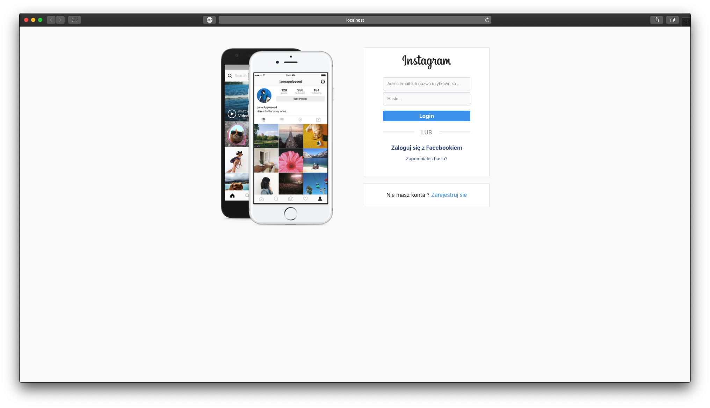
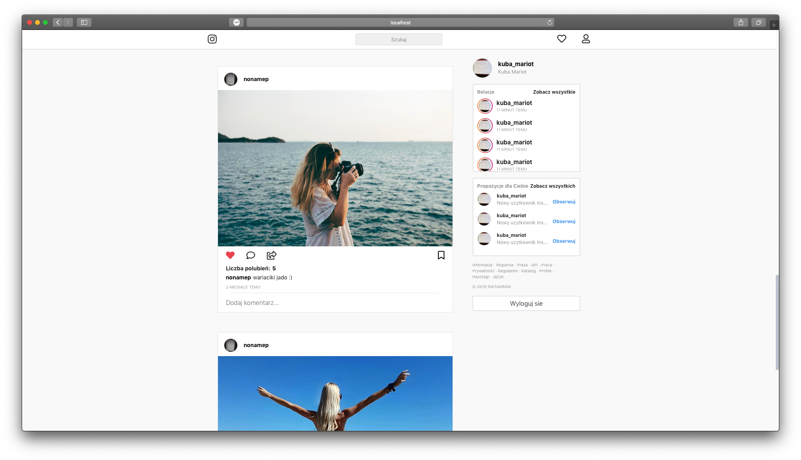
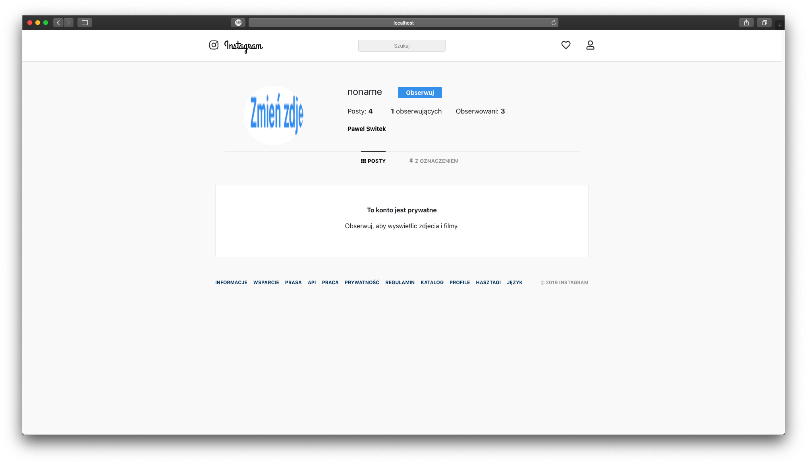
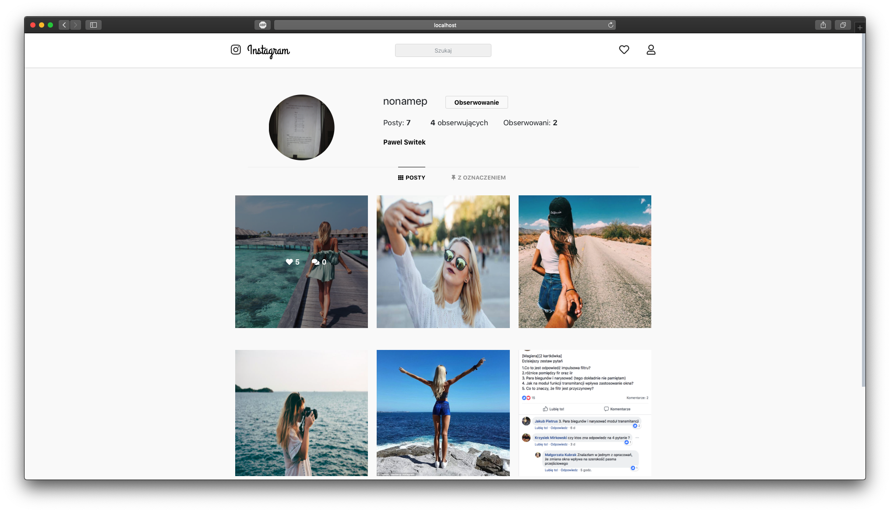
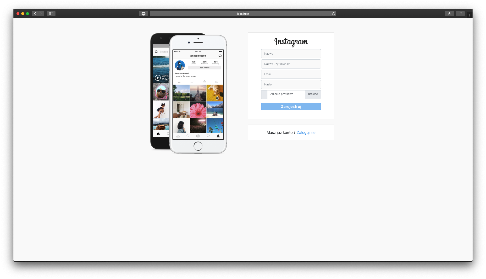
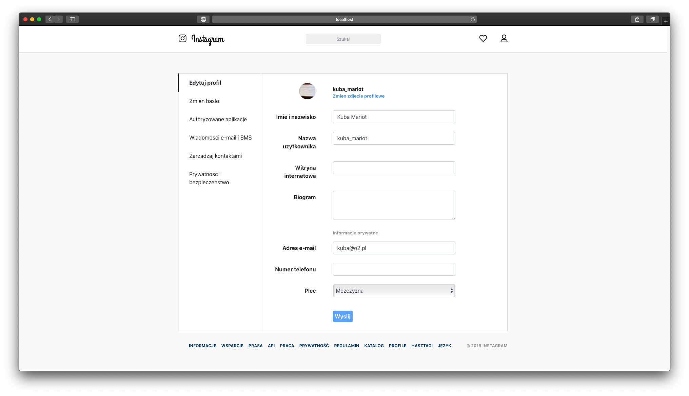

# instagram-clone
Instagram Clone (Spring Boot/JWT/React/Redux)

<table>
  <tr>
    <td></td>
    <td></td>
    <td></td>
    <td></td>
  <tr>
  <tr>
    <td></td>
    <td></td>
  <tr>
</table>
